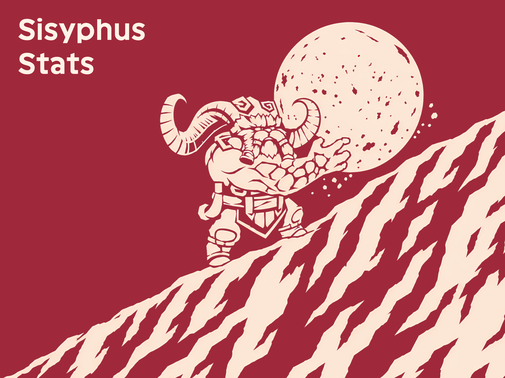
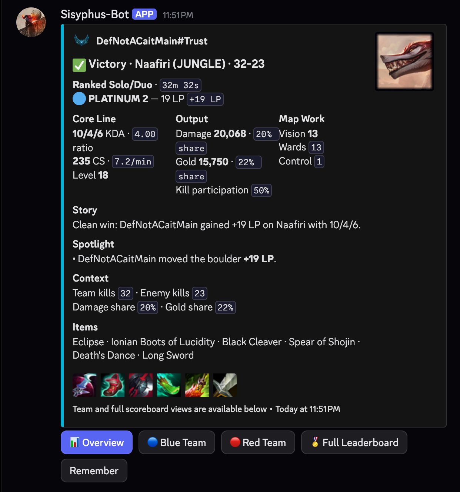
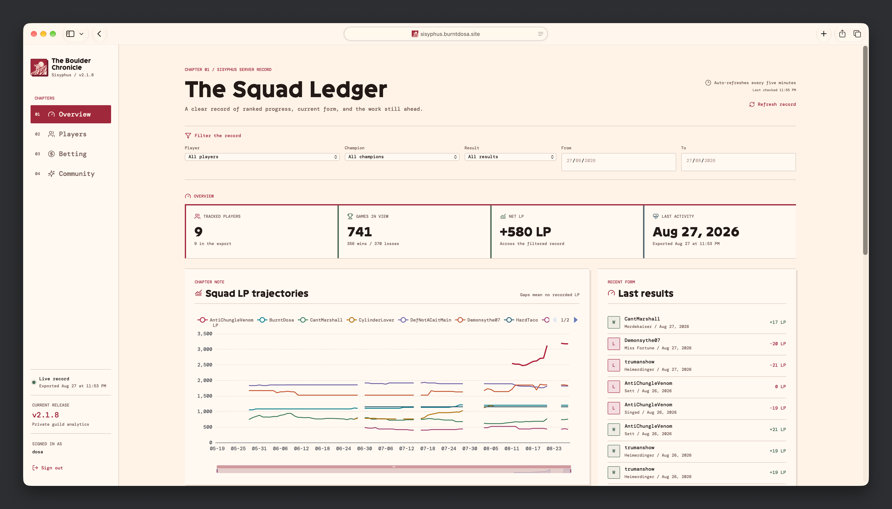
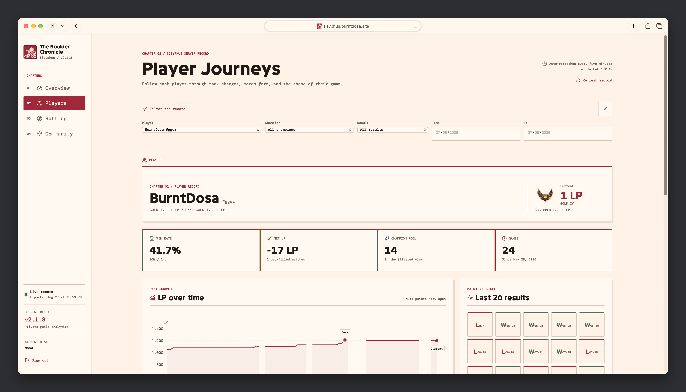

<p align="center">
  
</p>

<h1 align="center">Sisyphus</h1>

<p align="center">
  A Discord bot for a League of Legends squad. It tracks ranked Solo/Duo games and records the climb.
</p>

<p align="center">
  
  
  <a href="https://sisyphus.burntdosa.site"></a>
</p>

<p align="center">
  <a href="#in-discord">In Discord</a> |
  <a href="#private-dashboard">Dashboard</a> |
  <a href="#quick-start">Quick start</a> |
  <a href="#commands">Commands</a> |
  <a href="#privacy">Privacy</a>
</p>

## For Ranked Solo/Duo Squads

Sisyphus watches tracked Riot accounts and posts a recap after each new ranked Solo/Duo match.

It records rank, LP change, KDA, CS per minute, vision, damage, gold, items, and team scores. It ignores other queues.

The bot also supports Queue Board, Live Game Room, squad goals, rivalries, weekly recaps, monthly recaps, and Boulder Archive records.

Points markets use fake server points only. Members can place win or loss bets before a market locks.

## In Discord

Each recap keeps the important match data in one place. Members can open team views, the full leaderboard, or save a match memory.

<p align="center">
  
</p>

## Private Dashboard

The [Boulder Chronicle](https://sisyphus.burntdosa.site) uses Discord sign-in. Only members of the configured Discord server can access it.

The Overview shows the squad LP record and recent match form. The Players view shows rank, LP history, and recent results for one tracked player.

<p align="center">
  
</p>

<p align="center">
  
</p>

The dashboard receives a new private export every five minutes. Members can also refresh it manually.

## Quick Start

1. Get the source and enter the project directory.

   ```bash
   git clone https://github.com/BurntDosa/Sisyphus-Stats.git
   cd Sisyphus-Stats
   ```

2. Install the Python environment.

   ```bash
   uv sync
   ```

3. Create the private configuration file.

   ```bash
   cp env.example_v2 .env
   ```

4. Set `DISCORD_TOKEN`, `GUILD_ID`, `ADMIN_IDS`, `RIOT_KEY`, `OPGG_MCP_URL`, and `OPGG_REGION` in `.env`.

5. Start the bot.

   ```bash
   uv run python -m sisyphus
   ```

Enable Message Content Intent for the Discord bot. Use `env.example_v2` for the complete configuration list.

## Commands

Most commands work as slash commands and with the `!` prefix.

| Group | Commands |
| --- | --- |
| Start | `/help`, `/status`, `/dashboard` |
| Tracking | `/track`, `/untrack`, `/list`, `/link`, `/unlink`, `/whoami` |
| Matches | `/recap`, `/stats`, `/profile`, `/dailyreport`, `/report` |
| Squad | `/queueup`, `/queueboard`, `/queueclear`, `/weeklyrecap`, `/monthlyrecap`, `/halloffame`, `/squadgoal`, `/rivalry` |
| Points | `/markets`, `/bet`, `/editbet`, `/cancelbet`, `/mybets`, `/wallet`, `/leaderboard`, `/bprofile`, `/insurance` |
| Admin | `/marketopen`, `/marketstatus`, `/marketbets`, `/settlebet`, `/voidbet`, `/refund`, `/audit` |

Use `/help` in Discord for command arguments and current access rules.

## Privacy

`data.json` is private runtime state. It can contain linked accounts, match history, wallet data, audit entries, and service state.

Keep `data.json`, `.env`, SSH keys, push URLs, and backups out of Git. Make a timestamped `data.json` backup before risky state work.

The dashboard uses a selected, sanitized export. It excludes PUUIDs, raw Discord IDs, messages, channels, reports, audit actors, recap links, secrets, and raw `data.json`.

## Development

Run the main checks before you commit.

```bash
uv run python -m py_compile sisyphus/*.py scripts/smoke_embed_limits.py
uv run python scripts/smoke_embed_limits.py
uv run python scripts/smoke_status_health.py
uv run --directory dashboard python ../scripts/smoke_dashboard_auth.py
npm --prefix dashboard/web run typecheck
```

Use `uv` for Python dependency changes. Do not start a second bot process when the supervisor is active.

## Public Source Mirror

This repository is a source-only mirror of the private Sisyphus project. It does not include live data, configuration, backups, deployment files, or secrets.
